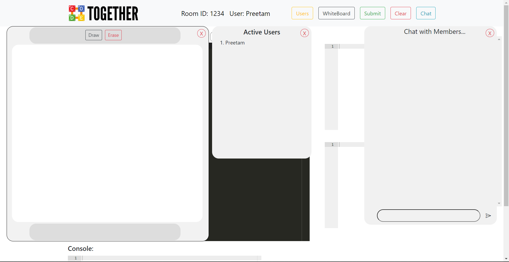

# Code Together
## Online collaborative Code Compiler

Code Together is an online collaborative code compiler which uses the principle of socket programming to interact with all users present in a room group in real time. The underlying concept of this project is to connect users in a room and give them facility to code together, chat together and draw together.

## Technologies Used:
1. Django
1. Django Channels
1. Javascript
1. Docker
1. Redis
1. HTML5
1. CSS3

## Run this project in your local PC
1. Clone the project:
    ```bash
    git clone git@github.com:iitianpreetam/code_together.git
    ```

1. Go to the directory:
    ```bash
    cd code_together
    ```

1. Create Virtual Environment:
    ```py
    ~ python -m venv env
    OR
    ~ virtualenv env
    ```

1. Activate Virtual Environment:
    - Windows:
    ```bash
    .\env\Scripts\activate
    ```

    - Linux/MacOS
    ```bash
    source env/bin/activate
    ```

1. Install Requirements
    ```py
    pip install -r requirements.txt
    ```

1. Start Django development server
    ```py
    python manage.py runserver
    ```
1. Redis setup on docker:
    - Install docker desktop
    - Pull redis image and create a container:
        ```bash
        docker run --name <container_name> -p 6379:6379 -d redis
        ```
    - This will start redis server, if not started then open docker desktop and start ther server from there.

1. Access Application on: `http://127.0.0.1:8000`

## Glimpse of our application

1. Home Page \
    

1. Room showing `drawing`, `chat` and `active user` window. \
    

1. Editor, I/p, O/P and Console: \
    

1. Chat window with two users: \
    